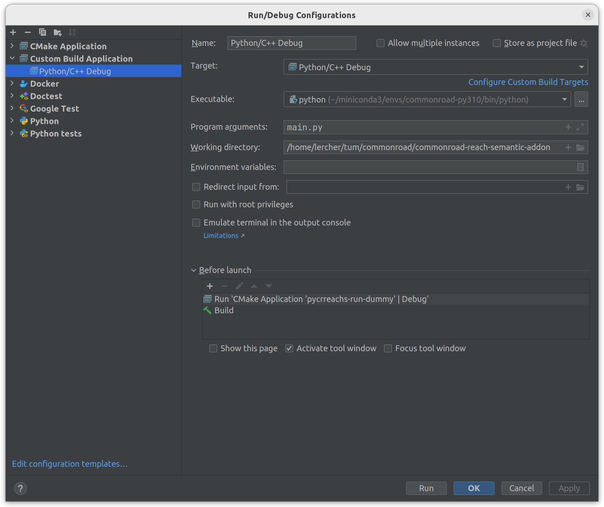
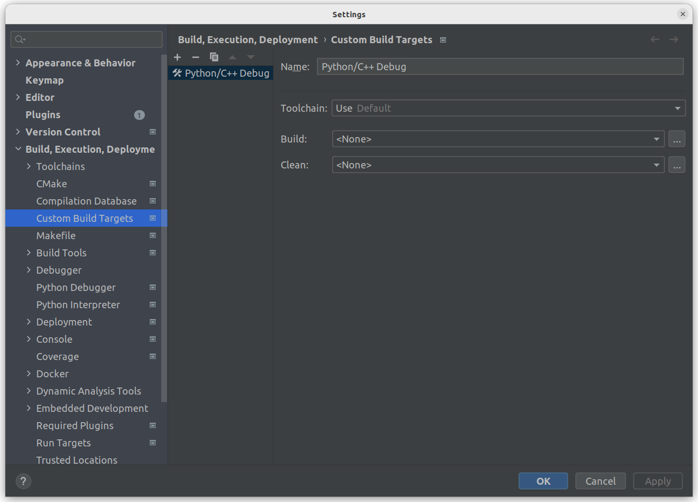
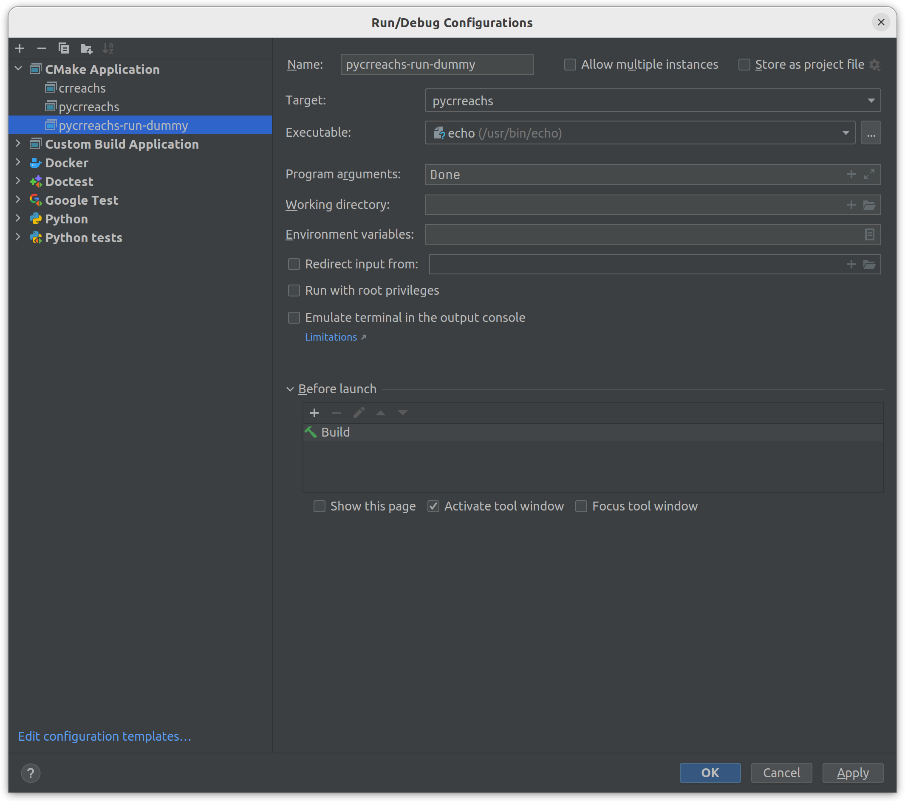

## Setting up a Local Development Environment

### Working with the Python Code

1. Follow the instructions for building the C++ bindings in the [README](../README.md).
2. If you are using Anaconda, make sure to select the correct Python environment in your IDE.

### Working with the C++ Code

For the following instructions, we assume that you are using an Anaconda environment named `commonroad` for
CommonRoad-Reach-Semantic.

* You can build the C++ code directly via CMake, which might be more convenient for local development.
  To do so, run the following commands within your Anaconda environment:
```bash
mkdir build && cd build
cmake -DCMAKE_BUILD_TYPE=Debug ..
cmake --build . -j $BUILD_JOBS
```

#### Building the C++ code from your IDE

If you want to build the code from your IDE, extra steps are necessary to ensure that the build uses the Python version
from your Anaconda environment.
You need to pass the following flags to CMake:

```
-DPYTHON_INCLUDE_DIR=/path/to/anaconda3/envs/commonroad/include/pythonX.Y
-DPYTHON_EXECUTABLE=/path/to/anaconda3/envs/commonroad/bin/python
```

> **Hint:** You can find the path to the Python executable with `which python` and the path to the Python include
> directory with `python -c "from distutils.sysconfig import get_python_inc; print(get_python_inc())"`.

To set this up in CLion, go to `Project settings > Build, Execution, Deployment > CMake` and add the flags
to `CMake options`.

#### Debugging the C++ code

To debug the C++ bindings that are called from Python, you can launch the Python interpreter under the C++ debugger.
To set this up with CLion, follow the steps described
under [option 2 here](https://www.jetbrains.com/help/clion/debugging-python-extensions.html#debug-custom-py).
Again, make sure to use the Python version from your Anaconda environment.

Below are screenshots of an example configuration.
Note that we add `pycrreachs-run-dummy` in the `Before launch` section of `Python/C++ Debug` to trigger rebuilding the
Python bindings.






